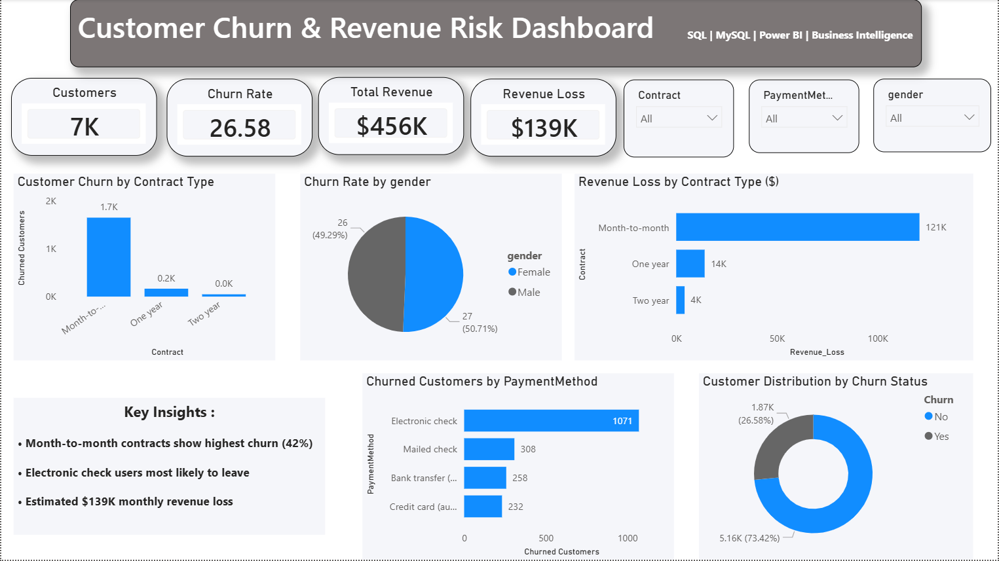

# 📊 Customer Churn & Revenue Risk Dashboard

## 🚀 Overview
This project analyzes customer churn behavior and revenue loss using SQL and Power BI.

The goal is to identify:
- Why customers leave
- Which segments are high risk
- How much revenue is lost
- Business actions to improve retention

---

## 🛠 Tech Stack
- MySQL (SQL queries)
- Power BI (Dashboard & DAX)
- Data Cleaning & EDA

---

## 📂 Dataset
Telco Customer Churn dataset  
~7,000+ customer records

Main features:
- tenure
- contract type
- payment method
- monthly charges
- churn status

---

## ⚙️ Steps Performed

### 1️⃣ Data Preparation
- Imported CSV into MySQL
- Cleaned missing values
- Created structured table

### 2️⃣ SQL Analysis
- Wrote 25+ SQL queries
- Aggregations
- CTEs
- Window functions
- Calculated churn rate and revenue loss

### 3️⃣ Dashboard Development
Built interactive Power BI dashboard with:
- KPI cards
- Churn by contract type
- Revenue loss by contract
- Payment method analysis
- Customer segmentation
- Slicers & filters

---

## 📈 Key Insights
- Month-to-month contracts show highest churn (~42%)
- Electronic check users most likely to leave
- Estimated $139K monthly revenue loss
- Short-tenure customers churn more frequently

---

## 📸 Dashboard Preview

---

## 🎯 Skills Demonstrated
- SQL analytics
- DAX calculations
- Data visualization
- Business intelligence
- Dashboard storytelling

---

## 👤 Author
Samir Devkar
